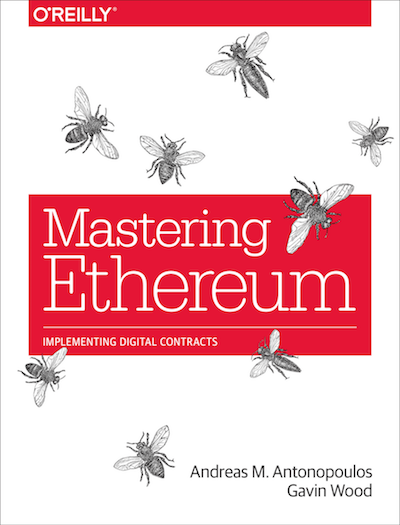
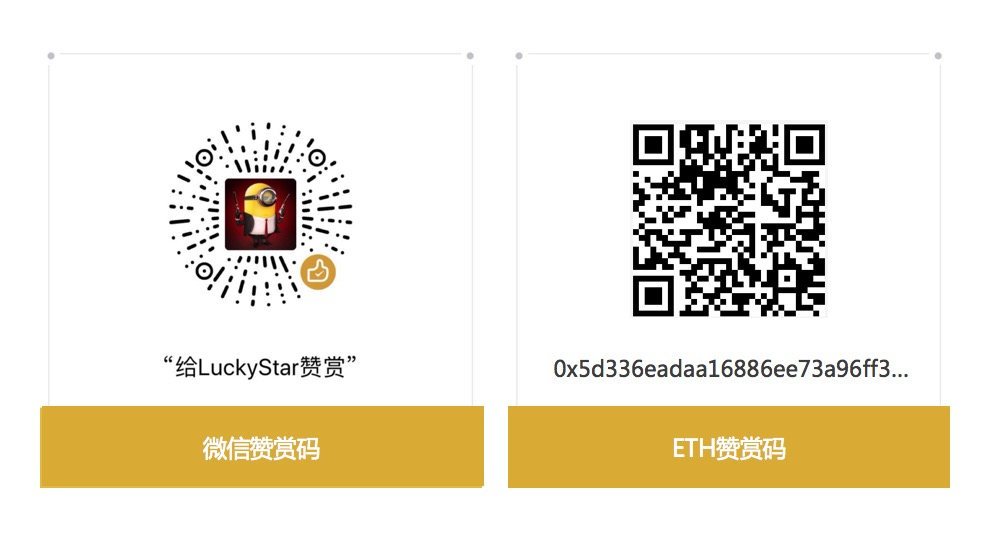

### [《精通以太坊——实现数字合约》](https://github.com/ethereumbook/ethereumbook) 中文版

### 目录

[前言](前言.asciidoc)

[术语](术语.asciidoc)

[第一章 什么是以太坊](第一章.asciidoc)

[第二章 以太坊基础](第二章.asciidoc)

[第三章 以太坊客户端](第三章.asciidoc)

[第四章 以太坊测试网](第四章.asciidoc)

[第五章 密钥和地址](第五章.asciidoc)

[第六章 钱包](第六章.asciidoc)

[第七章 交易](第七章.asciidoc)

[第八章 智能合约](第八章.asciidoc)

[第九章 开发工具，框架和库](第九章.asciidoc)

[第十章 Tokens](第十章.asciidoc)

[第十一章 去中心化应用（DApps）](第十一章.asciidoc)

[第十二章 预言机（Oracles）](第十二章.asciidoc)

[第十三章 燃气](第十三章.asciidoc)

[第十四章 以太坊虚拟机](第十四章.asciidoc)

[第十五章 共识](第十五章.asciidoc)

[第十六章 Vyper：面向合约的编程语言](第十六章.asciidoc)

[第十七章 DevP2P协议](第十七章.asciidoc)

[第十八章 以太坊标准](第十八章.asciidoc)

[第十九章 以太坊分叉历史](第十九章.asciidoc)

### 关于译者
互联网从业者，对经济学感兴趣，很早加入数字货币和区块链研究。

闲暇时间翻译，欢迎指正，感谢加星~

Wechat: 121402213

注：transaction 有两种翻译：交易，事务，在不同场景下使用不同的译法。

### 打赏

